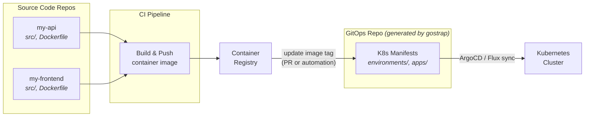
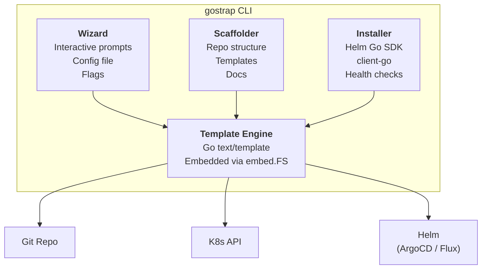

# gostrap

[](https://github.com/y0s3ph/gostrap/actions/workflows/ci.yml)
[](LICENSE)
[](https://go.dev/)
[](https://www.linkedin.com/in/jph91/)

From zero to GitOps in one command — opinionated CLI to bootstrap a production-ready GitOps workflow on any Kubernetes cluster.


## Table of Contents

- [The Problem](#the-problem)
- [Core Principles](#core-principles)
- [What It Sets Up](#what-it-sets-up)
  - [In the Cluster](#in-the-cluster)
  - [In the Git Repository](#in-the-git-repository)
- [How It Fits In Your Workflow](#how-it-fits-in-your-workflow)
- [Roadmap](#roadmap)
- [Architecture](#architecture)
  - [Component Responsibilities](#component-responsibilities)
- [Tech Stack](#tech-stack)
- [Planned CLI Interface](#planned-cli-interface)
- [Design Decisions](#design-decisions)
  - [Why App of Apps (ArgoCD) / Kustomization chain (Flux)?](#why-app-of-apps-argocd--kustomization-chain-flux)
  - [Why Kustomize over Helm for app manifests?](#why-kustomize-over-helm-for-app-manifests)
  - [Why Sealed Secrets as default?](#why-sealed-secrets-as-default)
  - [Secrets management: scalability and limitations](#secrets-management-scalability-and-limitations)
  - [Why Go?](#why-go)
  - [Why not just use a Helm chart for everything?](#why-not-just-use-a-helm-chart-for-everything)
- [Project Structure (Planned)](#project-structure-planned)
- [Related & Prior Art](#related--prior-art)
- [Development](#development)
  - [Prerequisites](#prerequisites)
  - [Build](#build)
  - [Test](#test)
  - [Local Kubernetes Cluster](#local-kubernetes-cluster)
  - [Quick Smoke Test](#quick-smoke-test)
- [Contributing](#contributing)
- [License](#license)

---

## The Problem

Adopting GitOps is widely accepted as a best practice, but getting started is surprisingly painful:

- **Too many choices**: ArgoCD vs. Flux, Helm vs. Kustomize, Sealed Secrets vs. SOPS vs. External Secrets, mono-repo vs. multi-repo…
- **Hours of glue work**: Installing the controller, structuring the repo, wiring environments, setting up secrets management, configuring RBAC, health checks, notifications…
- **Tribal knowledge**: Most teams figure it out through blog posts, trial and error, and copying from previous jobs. The "right" structure lives in someone's head, not in code.
- **Inconsistency**: Every team in the organization ends up with a slightly different GitOps setup, making platform support harder.

**gostrap** solves this by encoding opinionated best practices into a single CLI that scaffolds a complete, production-ready GitOps workflow in minutes.

## Core Principles

| Principle | Description |
|---|---|
| **Opinionated defaults, escape hatches everywhere** | Sensible defaults for 90% of cases, with every choice overridable via flags or config. |
| **Convention over configuration** | Standard directory structure and naming so teams across the org speak the same language. |
| **Day-2 ready** | Not just initial setup — includes patterns for promotions, rollbacks, secrets rotation, and drift detection. |
| **Cluster-agnostic** | Works on EKS, GKE, AKS, k3s, kind, or any conformant Kubernetes cluster. |
| **Idempotent** | Safe to re-run. Applies only what's missing, never overwrites existing customizations. |

## What It Sets Up

Running `gostrap init` on a cluster produces:

### In the Cluster

- GitOps controller installed and configured (ArgoCD by default, Flux as alternative)
- Namespace structure for the controller and managed environments
- RBAC for the GitOps controller (least privilege)
- Secrets management operator (Sealed Secrets by default, External Secrets Operator as alternative)
- Optional: Ingress for the ArgoCD UI with TLS

### In the Git Repository

```
gitops-repo/
├── bootstrap/                      # One-time cluster setup
│   ├── argocd/                     # ArgoCD installation manifests (if ArgoCD selected)
│   │   ├── namespace.yaml
│   │   ├── kustomization.yaml     # Pinned ArgoCD version + patches
│   │   └── appproject-default.yaml
│   ├── flux-system/                # Flux installation manifests (if Flux selected)
│   │   ├── namespace.yaml
│   │   ├── kustomization.yaml     # Pinned Flux version
│   │   └── gotk-sync.yaml         # GitRepository + root Kustomization
│   └── sealed-secrets/             # Secrets management setup
│       ├── kustomization.yaml
│       └── sealedsecret-example.yaml
│
├── apps/                           # Controller-specific app definitions
│   ├── _root.yaml                  # Root Application (ArgoCD) or GitRepository+Kustomization (Flux)
│   ├── my-api-dev.yaml            # Per-app per-env definition
│   └── my-api-staging.yaml
│
├── environments/                   # Per-environment configuration
│   ├── base/                       # Shared base manifests
│   │   ├── my-api/
│   │   │   ├── kustomization.yaml
│   │   │   ├── deployment.yaml
│   │   │   ├── service.yaml
│   │   │   └── hpa.yaml
│   │   └── my-frontend/
│   │       ├── kustomization.yaml
│   │       ├── deployment.yaml
│   │       └── service.yaml
│   │
│   ├── dev/                        # Dev overrides
│   │   ├── my-api/
│   │   │   ├── kustomization.yaml  # patches: replicas=1, resources=small
│   │   │   └── sealed-secret.yaml
│   │   └── kustomization.yaml
│   │
│   ├── staging/                    # Staging overrides
│   │   ├── my-api/
│   │   │   ├── kustomization.yaml
│   │   │   └── sealed-secret.yaml
│   │   └── kustomization.yaml
│   │
│   └── production/                 # Production overrides
│       ├── my-api/
│       │   ├── kustomization.yaml  # patches: replicas=3, resources=large, PDB
│       │   └── sealed-secret.yaml
│       └── kustomization.yaml
│
├── platform/                       # Platform-level services (managed by platform team)
│   ├── cert-manager/
│   ├── external-dns/
│   ├── ingress-nginx/
│   └── monitoring/
│
├── policies/                       # OPA/Kyverno policies (optional)
│   ├── require-labels.yaml
│   ├── disallow-latest-tag.yaml
│   └── require-resource-limits.yaml
│
└── docs/
    ├── ARCHITECTURE.md             # How this repo is structured and why
    ├── ADDING-AN-APP.md            # Step-by-step guide for dev teams
    ├── SECRETS.md                  # How to manage secrets in this setup
    └── TROUBLESHOOTING.md          # Common issues and fixes
```

## How It Fits In Your Workflow

gostrap generates a **configuration-only** repository. Your application source code lives in separate repos — this is the standard GitOps separation of concerns:



| Repository | Contains | Who owns it |
|---|---|---|
| `my-api`, `my-frontend` | Application source code, Dockerfile, tests, CI pipeline | Development teams |
| `gitops-repo` (generated by gostrap) | Kubernetes manifests, environment overlays, controller config | Platform / DevOps team |
| `gostrap` (this repo) | The CLI tool itself | Open source |

The deployment flow is: developers push code → CI builds and pushes a container image → the image tag is updated in the gitops-repo (via PR or automation) → the GitOps controller (ArgoCD or Flux) detects the change and syncs to the cluster.

This separation gives you auditable deployments (every cluster change is a Git commit), rollback via `git revert`, and clear ownership boundaries between dev and ops.

## Roadmap

> Track progress and detailed issues on the [gostrap roadmap](https://github.com/users/y0s3ph/projects/1) board.

| Phase | Milestone | Status | Summary |
|---|---|---|---|
| **1 — Core Bootstrap** | [v0.1.0](https://github.com/y0s3ph/gostrap/milestone/1?closed=1) | Done | Interactive wizard, repo scaffolding, ArgoCD installer, Sealed Secrets, documentation generation |
| **2 — Flux & Advanced Secrets** | [v0.2.0](https://github.com/y0s3ph/gostrap/milestone/2) | In Progress | Flux CD controller **(done)**, External Secrets Operator **(done)**, SOPS **(done)**, multi-cluster, Helm chart support |
| **3 — Day-2 Operations** | [v0.3.0](https://github.com/y0s3ph/gostrap/milestone/3) | Planned | `add-app`, `add-env`, `validate`, `diff`, `promote` commands, pre-commit hooks |
| **4 — Platform Integration** | [v0.4.0](https://github.com/y0s3ph/gostrap/milestone/4) | Planned | Notifications, Image Updater, CI workflow templates, webhooks, terminal dashboard |

## Architecture



### Component Responsibilities

- **Wizard**: Gathers user preferences through interactive prompts or config file/flags. Validates input and produces a normalized configuration object.
- **Scaffolder**: Generates the Git repository structure from Go `text/template` templates. Handles directory creation, manifest rendering, and documentation generation. Idempotent — detects existing files and skips them.
- **Installer**: Applies bootstrap manifests to the cluster. Installs ArgoCD/Flux via the Helm Go SDK, sets up secrets management, configures RBAC. Includes health checks to verify successful installation.
- **Template Engine**: Go `text/template`-based rendering layer used by both Scaffolder and Installer. Templates are embedded in the binary via `embed.FS`. All generated manifests are templates with sensible defaults that can be customized.

## Tech Stack

| Component | Technology | Rationale |
|---|---|---|
| Language | **Go 1.23+** | Native to the Kubernetes ecosystem; compiles to a single static binary with zero runtime dependencies |
| CLI framework | **Cobra** | De facto standard for Go CLIs — used by kubectl, helm, gh, and most CNCF tools |
| Terminal UI | **Bubble Tea + Lip Gloss** (Charmbracelet) | Rich interactive TUIs with progress indicators, selection menus, and styled output |
| Template engine | **text/template** (stdlib) | Go's built-in template engine — no external dependency, sufficient for YAML manifest generation |
| K8s client | **client-go** (official) | The reference Kubernetes client library, always up-to-date with the latest API |
| Helm integration | **Helm Go SDK** (`helm.sh/helm/v3`) | Native library integration — no subprocess calls, no dependency on the user having Helm installed |
| Config file | **YAML** (`gopkg.in/yaml.v3`) + **go-playground/validator** | Natural format for K8s engineers, with struct tag-based validation |
| Build & release | **GoReleaser** | Cross-compilation, GitHub releases, Homebrew tap, Docker images — all in one workflow |
| Testing | **testing** (stdlib) + **testify** | Standard Go testing with `t.TempDir()` for repo scaffolding tests |
| Linting | **golangci-lint** | Meta-linter aggregating 50+ linters in a single fast run |

## Planned CLI Interface

```bash
# Interactive wizard (recommended for first-time setup)
gostrap init

# Non-interactive with flags
gostrap init \
  --controller argocd \
  --controller-version 2.13.1 \
  --secrets sealed-secrets \
  --environments dev,staging,production \
  --repo-path ./gitops-repo \
  --cluster-context prod-eu-west-1

# From config file (for reproducibility / team standardization)
gostrap init --config bootstrap-config.yaml

# Add a new application to the existing structure
gostrap add-app my-new-service \
  --type deployment \
  --port 8080 \
  --has-ingress \
  --has-hpa

# Add a new environment
gostrap add-env qa --base staging

# Validate repo structure
gostrap validate ./gitops-repo

# Compare environments
gostrap diff dev production --app my-api

# Promote an app between environments
gostrap promote my-api --from staging --to production
```

### Example Config File

```yaml
# bootstrap-config.yaml
controller:
  type: argocd
  version: "2.13.1"
  ingress:
    enabled: true
    host: argocd.internal.company.com
    tls: true

secrets:
  type: sealed-secrets

environments:
  - name: dev
    auto_sync: true
    prune: true
  - name: staging
    auto_sync: true
    prune: false
  - name: production
    auto_sync: false      # manual sync for production
    prune: false
    require_pr: true

applications:
  - name: example-api
    type: deployment
    port: 8080
    replicas:
      dev: 1
      staging: 2
      production: 3
    has_ingress: true
    has_hpa: true
    hpa:
      min_replicas: 2
      max_replicas: 10
      target_cpu: 70

platform_services:
  cert_manager: true
  external_dns: false
  ingress_nginx: true
  monitoring: false

policies:
  enabled: true
  engine: kyverno
```

### Interactive Wizard Flow (Planned)

```
$ gostrap init

  ╭─────────────────────────────────────────╮
  │            gostrap v0.1.0               │
  │   From zero to GitOps in one command    │
  ╰─────────────────────────────────────────╯

  ? Select GitOps controller:
    ❯ ArgoCD (recommended)
      Flux CD

  ? ArgoCD version: (2.13.1)

  ? Select secrets management:
    ❯ Sealed Secrets (simple, self-contained)
      External Secrets Operator (AWS SM, Vault, etc.)
      SOPS (git-native encryption)

  ? Environments to create: (dev, staging, production)

  ? Scaffold an example application? (Y/n)

  ? Target repo path: (./gitops-repo)

  ? Cluster context: (current: prod-eu-west-1)

  ⠸ Installing ArgoCD v2.13.1...          ✓
  ⠸ Setting up Sealed Secrets...          ✓
  ⠸ Generating repo structure...          ✓
  ⠸ Creating example application...       ✓
  ⠸ Generating documentation...           ✓
  ⠸ Verifying cluster health...           ✓

  ✓ GitOps bootstrap complete!

  Next steps:
    1. cd ./gitops-repo && git init && git add -A && git commit -m "feat: initial gitops structure"
    2. Push to your Git provider
    3. ArgoCD UI: https://argocd.internal.company.com
    4. Read docs/ADDING-AN-APP.md to onboard your first real application
```

## Design Decisions

### Why App of Apps (ArgoCD) / Kustomization chain (Flux)?

For **ArgoCD**, gostrap uses the [App of Apps pattern](https://argo-cd.readthedocs.io/en/stable/operator-manual/cluster-bootstrapping/#app-of-apps-pattern): a root Application watches `apps/`, and each file defines an Application pointing to environment overlays. For **Flux**, the equivalent is a root `Kustomization` CRD that watches `apps/`, where each file is a Flux `Kustomization` pointing to an overlay. Both approaches provide:
- Single entry point for the entire cluster state.
- Self-service: dev teams add a YAML to `apps/` to onboard.
- Declarative: the list of applications is version-controlled.

### Why Kustomize over Helm for app manifests?

- Kustomize works with plain YAML — no templating language to learn.
- Overlays make environment differences explicit and auditable.
- Better for GitOps: `kustomize build` output is deterministic.
- Helm is used for installing third-party software (ArgoCD, cert-manager), not for application manifests.

### Why Sealed Secrets as default?

- Zero external dependencies (no Vault, no cloud provider secrets manager).
- Works on any cluster, including local development (kind, k3s).
- Encrypted secrets can live in Git safely.
- Simple mental model: `kubeseal` encrypts, controller decrypts.
- External Secrets Operator is offered as an alternative for teams already using AWS Secrets Manager, Vault, etc.

### Secrets management: scalability and limitations

Each option fits different team sizes and needs:

| Option | Small team (1–5) | Growing team (5–20) | Large team (20+) |
|--------|------------------|---------------------|------------------|
| **Sealed Secrets** | Ideal | Good (key lives in cluster; no manual distribution) | Good, but no per-secret audit trail |
| **SOPS (age)** | Ideal | Usable; key rotation and onboarding are manual | **Not recommended** — shared key, no access control |
| **SOPS (KMS)** | Optional | **Ideal** — IAM controls access, no key distribution | **Ideal** — revoke access when people leave |
| **External Secrets Operator** | Optional | **Ideal** — central vault, dynamic secrets | **Best** — audit, leases, fine-grained policies |

**SOPS with a single age key** does not scale well: everyone shares the same private key, so when someone leaves you must rotate the key and re-encrypt all secrets; there is no per-environment or per-secret access control. For growing teams, prefer **External Secrets Operator** (Vault, AWS Secrets Manager, etc.) or **SOPS with KMS** (AWS KMS, GCP KMS, Azure Key Vault), where access is managed via IAM and key distribution is not needed.

Planned improvement: [SOPS with KMS support (#28)](https://github.com/y0s3ph/gostrap/issues/28) — use cloud KMS instead of (or in addition to) age for scalable, IAM-based access.

### Why Go?

- **Native to the Kubernetes ecosystem**: Go is the language behind Kubernetes, ArgoCD, Flux, Helm, and most CNCF tooling. Contributors from this ecosystem already write Go.
- **Single binary distribution**: `curl`, `chmod +x`, done. No runtime, no interpreter, no virtual environments. Works seamlessly in CI pipelines, air-gapped environments, and scratch containers.
- **First-class Kubernetes and Helm libraries**: `client-go` and the Helm Go SDK are the reference implementations — always up-to-date, fully featured, and well-documented. No subprocess wrappers needed.
- **Embedded templates**: Go's `embed.FS` allows shipping all manifest templates inside the binary itself, eliminating the need to manage template files on disk.
- **Cross-compilation**: A single `goreleaser` config produces binaries for Linux, macOS, and Windows (amd64/arm64), plus Homebrew formulas and Docker images.

### Why not just use a Helm chart for everything?

Helm charts are great for distributing reusable software, but they're a poor fit for representing an organization's unique GitOps repository structure. Each team's environments, naming conventions, and promotion workflows are different. A scaffolding tool that generates plain YAML with Kustomize overlays gives teams full ownership and visibility over their manifests, without the abstraction layer of `values.yaml`.

## Project Structure (Planned)

```
gostrap/
├── cmd/
│   └── gostrap/
│       └── main.go                 # Entrypoint
├── internal/
│   ├── wizard/
│   │   ├── wizard.go               # Interactive prompts (Bubble Tea)
│   │   └── config.go               # Config file parsing & validation
│   ├── scaffolder/
│   │   ├── repo.go                 # Repo structure generation
│   │   ├── apps.go                 # Application manifest generation
│   │   ├── environments.go         # Environment overlay generation
│   │   └── docs.go                 # Documentation generation
│   ├── installer/
│   │   ├── argocd.go               # ArgoCD installation via Helm Go SDK
│   │   ├── flux.go                 # Flux installation
│   │   ├── secrets.go              # Sealed Secrets / ESO setup
│   │   └── health.go               # Post-install health checks
│   ├── templates/                  # Go text/template files (embedded via embed.FS)
│   │   ├── argocd/
│   │   ├── flux/
│   │   ├── apps/
│   │   ├── environments/
│   │   ├── platform/
│   │   ├── policies/
│   │   ├── docs/
│   │   └── embed.go                # //go:embed directives
│   └── models/
│       └── config.go               # Configuration structs with validation tags
├── pkg/
│   └── kube/
│       └── client.go               # Kubernetes client helpers (client-go)
├── tests/
│   ├── wizard_test.go
│   ├── scaffolder_test.go
│   ├── installer_test.go
│   └── testdata/
│       └── sample-configs/
├── examples/
│   ├── bootstrap-config.yaml       # Example config file
│   └── github-actions-promote.yml  # Example promotion workflow
├── .goreleaser.yaml                # Cross-compilation & release config
├── go.mod
├── go.sum
├── LICENSE
└── README.md
```

## Related & Prior Art

| Tool | Comparison |
|---|---|
| [ArgoCD Autopilot](https://github.com/argoproj-labs/argocd-autopilot) | Go-based, ArgoCD-only, opinionated but less flexible. Inspiration for the App of Apps approach. |
| [Flux Bootstrap](https://fluxcd.io/flux/cmd/flux_bootstrap/) | Built into Flux CLI, Flux-only, focused on controller installation. |
| [Kubefirst](https://kubefirst.io/) | Full platform (CI/CD, secrets, IDP), heavier scope, includes cloud provisioning. |
| [Backstage](https://backstage.io/) | Developer portal with scaffolding capabilities, much larger scope. |

**gostrap** differentiates by being lightweight, controller-agnostic, and focused exclusively on the GitOps repo structure + controller setup — without trying to be an entire platform.

## Development

### Prerequisites

- [Go 1.23+](https://go.dev/dl/)
- [Docker](https://docs.docker.com/get-docker/)
- [kind](https://kind.sigs.k8s.io/) — `go install sigs.k8s.io/kind@latest`
- [kubectl](https://kubernetes.io/docs/tasks/tools/)

### Build

```bash
go build -o gostrap ./cmd/gostrap/
```

### Test

```bash
go test ./...
```

### Local Kubernetes Cluster

Scripts in `hack/` manage a local [kind](https://kind.sigs.k8s.io/) cluster preconfigured with ingress port mappings (80/443) for testing ArgoCD UI access:

```bash
# Create cluster (idempotent — skips if already exists)
./hack/setup-kind.sh            # default name: gitops-dev
./hack/setup-kind.sh my-cluster # custom name

# Delete cluster
./hack/teardown-kind.sh
./hack/teardown-kind.sh my-cluster
```

### Quick Smoke Test

```bash
# Build and run the wizard in non-interactive mode
go run ./cmd/gostrap/ init \
  --controller argocd \
  --secrets sealed-secrets \
  --environments dev,staging,production \
  --repo-path ./test-repo \
  --cluster-context kind-gitops-dev
```

## Contributing

Contributions are welcome. Please open an issue to discuss your idea before submitting a PR.

This project follows:
- [Conventional Commits](https://www.conventionalcommits.org/) for commit messages.
- Trunk-based development with short-lived feature branches.
- All code must pass `golangci-lint run` and `go test ./...` before merge.

## License

[Apache License 2.0](LICENSE)
